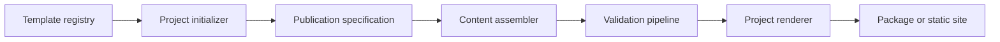

# Beacon Architecture

## Purpose and scope

Beacon uses a layered, contract-driven architecture. This document owns structural boundaries, dependency direction, integration rules, and current-to-target evolution. Logical responsibilities remain canonical in [SYSTEM.md](SYSTEM.md).

## Layer model

1. **Intent and contracts** — identity, policy, specifications, schemas, and accepted decisions.
2. **Domain** — canonical concepts and pure domain behavior.
3. **Application** — planning, orchestration, use cases, and state transitions.
4. **Adapters** — filesystems, providers, frameworks, renderers, and external tools.
5. **Interfaces** — CLI, library, site, reports, generated artifacts, and automation contracts.
6. **Evidence** — tests, diagnostics, provenance, manifests, and health projections.

Dependencies point inward toward stable contracts and domain behavior. External details do not become canonical domain truth.

## Structural view

The diagram is conceptual. [SYSTEM.md](SYSTEM.md) remains authoritative for responsibilities and implementation evidence determines current availability.

## Project-owned execution boundary

Every initialized profile carries its renderer/checker adapter, Makefile,
Taskfile, schemas, and required local assets. Beacon discovers, initializes,
plans, validates, and packages that contract, but a product build does not reach
back into the Beacon checkout. Make, Task, and the Beacon execution adapter are
interfaces over the same project-owned implementation.

The `publication-hub` profile applies that boundary to product websites. The
product owns a versioned source catalog and receives a deterministic static
tree with a versioned public catalog. The renderer is host-neutral: it neither
selects a GitHub Pages source nor mutates DNS, certificates, releases, or
deployment settings.

Site lifecycle and publication lifecycle are independent. A draft or published
site may truthfully describe planned or draft slots. Deployment is not evidence
that a paper or magazine is available; only a validated product catalog backed
by real resources may make that claim.

## Dependency rules

- Sibling domain capabilities integrate through versioned public contracts, not direct access to internals.
- Generated artifacts never become the canonical source unless an accepted decision explicitly changes ownership.
- Provider and platform adapters depend on application ports; core behavior does not depend on a provider implementation.
- Read, plan, apply, verify, publish, and recover remain separate authority boundaries when consequential.
- Cross-repository references use releases, immutable commits, schemas, packages, or documented APIs rather than mutable default-branch assumptions.

## Ecosystem interfaces

- Renderflow
- Reflector
- Relay
- Antidote
- GitHub Pages
- Zenodo and scholarly archives
- future organization white-paper workflows

## Deployment and portability

The architecture favors independently usable local and self-hosted operation. Optional managed services may add availability, collaboration, support, and hosted infrastructure without becoming the canonical holder of portable state.

## Evidence and uncertainty

- **Observed:** The root registry and project-owned adapters provide five independently buildable publication profiles, including a host-neutral publication hub.
- **Decided:** Products retain canonical content, presentation overrides, publication truth, and local execution; Beacon owns reusable profile contracts and orchestration.
- **Decided:** Relay and host providers consume validated artifacts without becoming local build dependencies.
- **Proposed:** Release, dossier/PDF-A, component-library, and fleet synchronization work remains governed by the roadmap until implemented.
