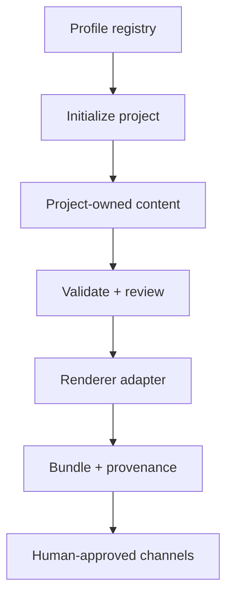

# Beacon Roadmap

<!-- BEGIN ROADMAP EXECUTION SNAPSHOT -->
<!-- roadmap-manifest
schema: hygiene.roadmap/v1alpha1
repository: egohygiene/beacon
visibility: public
publication: central
route: /roadmap/beacon/
updated: 2026-08-26
-->
## 2026-08-26 execution snapshot

> This roadmap is the issue-generation and execution handoff derived from the [2026-08-25 readiness audit](audits/beacon-readiness-audit-2026-08-25.md). It prioritizes a usable local research-publication workflow before complete organization synchronization.

**Lifecycle:** seed, standalone extraction  
**Current gate:** Keep the profile-first authoring path usable while the shared Beacon core matures; the active slice is the reusable magazine/print profile in issue `#3`.
**North-star outcome:** A local-first publication toolkit that lets a researcher initialize, write, validate, render, package, and publish reproducible papers and grant attachments without cloning another project's infrastructure.

### Definition of useful

Beacon reaches its first useful threshold when a clean environment can perform an equivalent workflow:

```bash
beacon init research-paper "../my-paper" \
  --title "My Research Paper" \
  --author "Alan Szmyt"
cd "../my-paper"
beacon doctor
beacon validate
beacon build
beacon package
```

The exact commands may evolve, but the capabilities may not be replaced by undocumented manual steps.

At that threshold:

- one neutral paper fixture builds in local and CI-equivalent environments;
- the project manifest pins its profile/template and records provenance;
- Reflector validates as a compatibility consumer without a disruptive rewrite;
- Antidote can leave Empathy and become a standalone paper repository;
- a current NIMH concept proposal can be scaffolded while submission-specific gates remain explicit.

### Execution principles

- Working direct paths come before perfect fleet synchronization.
- `.staging` is intake, not a directory to promote wholesale.
- Project content remains owned by the project repository.
- Beacon orchestrates renderers through adapters; Renderflow owns rendering behavior.
- Profiles and templates are versioned packages, not anonymous copied files.
- External publication and grant submission remain human-gated.
- Current official sources and the selected NOFO override a bundled grant template.
- A milestone closes only with consumer evidence, not file count or commit count.

### Target capability flow



### Quest line

<!-- roadmap-step
id: BEA-Q01
status: complete
depends_on: []
issues: [1, 2, 3, 5]
-->
#### BEA-Q01 — Define the publication boundary

**State:** `complete`
**Depends on:** None

**Outcome:** Beacon is established as the standalone publication project/profile, validation, packaging, and distribution-coordination capability.

**Exit criteria:**

- [x] Repository purpose and architectural boundaries are documented.
- [x] Rendering is delegated to Renderflow.
- [x] Initial publication-format issues exist.

**Evidence:**

- Architecture PR `#4` merged on 2026-08-19.
- Issues `#1`, `#2`, `#3`, and `#5` capture the initial format ambitions.

<!-- roadmap-step
id: BEA-Q02
status: active
depends_on: [BEA-Q01]
issues: []
-->
#### BEA-Q02 — Promote the standalone Beacon core

**State:** `active`
**Depends on:** `BEA-Q01`

**Outcome:** The existing CLI, contracts, tests, and canonical starter package run from the Beacon repository root without Empathy assumptions.

**Scope:**

- promote `.staging` core code, schemas, tests, Taskfile, and the intentionally selected starter package;
- split reusable Rust domain/application behavior from the CLI interface;
- reconcile or remove the duplicate Python validator;
- correct repository/package metadata and standalone paths;
- add `Cargo.lock`, documented tool versions, and a clean-checkout smoke test;
- update README, architecture evidence, and command documentation;
- leave `.staging/latex` inert.

**Exit criteria:**

- [ ] `beacon list`, `inspect`, `validate`, and `init` run from the repository root.
- [ ] One shared fixture proves schema and CLI validation agree.
- [ ] Initialization remains deterministic and refuses unsafe overwrite.
- [ ] Local `task check` and CI run the same contract.
- [ ] No active path depends on `egohygiene/empathy`.

**Current evidence:**

- A working Rust/Python vertical slice and tests were observed under `.staging`.
- No Beacon Actions runs or active root implementation were observed.

<!-- roadmap-step
id: BEA-Q03
status: complete
depends_on: [BEA-Q02]
issues: [5]
-->
#### BEA-Q03 — Ship the minimum useful research-paper profile

**State:** `complete`
**Depends on:** `BEA-Q02`

**Outcome:** `beacon#5` provides a neutral, versioned, reproducible academic paper profile that builds immediately and can evolve without copying untracked internals.

**Scope:**

- extract the smallest proven authoring/build/metadata surface from Reflector's completed `template/`;
- support modular native LaTeX source, bibliography, figures, tables, equations, appendices, acknowledgements, limitations, ethics, and data-availability sections;
- define profile, template-package, project-manifest, renderer-adapter, and output-bundle contracts;
- provide `doctor`, `validate`, `build`, and `package` flows;
- support Renderflow through a stable adapter and a documented local build provider;
- record template/profile version, source revision, toolchain, checksums, and build evidence;
- keep journal/publisher classes as later adapters rather than the universal source.

**Exit criteria:**

- [x] A clean generated project builds a PDF from a minimal fixture.
- [x] Repeated clean builds use pinned/documented dependencies and produce explainable provenance.
- [x] Citation, reference, figure, link, and compilation failures are actionable.
- [x] A project can inspect its pin and preview an upgrade without silent mutation.
- [x] The current minimal Pandoc/Tera package is either intentionally retained under a distinct profile or superseded with a migration note.

**Evidence:** Research-paper profile merged in PR `#10` on 2026-08-26.

<!-- roadmap-step
id: BEA-Q04
status: planned
depends_on: [BEA-Q03]
issues: []
-->
#### BEA-Q04 — Prove Reflector compatibility

**State:** `planned`  
**Depends on:** `BEA-Q03`

**Outcome:** Reflector becomes the canonical compatibility canary for Beacon's research and publication contracts without surrendering project ownership.

**Scope:**

- add a project manifest/adapter mapping Reflector's existing metadata, paper, figures, bibliography, build, and release surfaces;
- run Beacon validation and packaging against the existing layout;
- compare reusable behavior with Beacon and route generalized fixes upstream;
- preserve Reflector's manuscript, DOI, history, site, magazine, and release identity;
- record any intentional compatibility exceptions.

**Exit criteria:**

- [ ] Reflector passes the declared Beacon compatibility profile in a clean environment.
- [ ] No published content or canonical path is moved merely for conformity.
- [ ] Shared behavior has one canonical owner and a pinned consumer relationship.
- [ ] A compatibility report records supported profile and exceptions.

<!-- roadmap-step
id: BEA-Q05
status: planned
depends_on: [BEA-Q03]
issues: []
-->
#### BEA-Q05 — Graduate Antidote into its own repository

**State:** `planned`  
**Depends on:** `BEA-Q03`

**Outcome:** The incubated Antidote research program becomes the first new standalone Beacon paper project and can move rapidly through literature, methods, evidence, and publication work.

**Owning issue:** [`egohygiene/empathy#71`](https://github.com/egohygiene/empathy/issues/71)

**Scope:**

- inventory and preserve `empathy/research/antidote` with its source commit;
- create the standalone repository using the versioned research-paper profile;
- preserve manuscript, references, figures, data, bootstrap notes, and epistemic boundaries;
- remove duplicated generic templates once Beacon owns them;
- leave a migration pointer in Empathy and eliminate the second writable canonical copy;
- run the literature/novelty scan before freezing contribution or experimental architecture.

**Exit criteria:**

- [ ] Antidote has one canonical standalone repository.
- [ ] The project builds and validates through its pinned Beacon profile.
- [ ] Research provenance and evidence classifications survive migration.
- [ ] Empathy is not a runtime or build dependency.

<!-- roadmap-step
id: BEA-Q06
status: active
depends_on: [BEA-Q01]
issues: []
-->
#### BEA-Q06 — Create a current NIH/NIMH proposal profile and workspace

**State:** `active`  
**Depends on:** `BEA-Q01` for profile authorship; `BEA-Q03` for final CLI integration

**Outcome:** A researcher can begin a high-quality NIMH concept proposal immediately, then pin a mechanism/NOFO and produce a compliant attachment bundle without relying on the stale 2019 intake.

**Current slice:** The original `nih-nimh-rpg` multi-attachment LaTeX package is
being introduced as the first active root template. The two duplicated 2019 NIH
reference directories are removed in the same migration so `.staging` shrinks
as each reference is deliberately dispositioned.

**Profile design:**

- create a newly authored `nih-nimh-rpg` profile family from official NIH/NIMH sources;
- represent the application as separately rendered attachments, not one monolithic document;
- record `forms_version`, activity code, NOFO, due date, applicant organization, program contact, source URLs, verification dates, attachment limits, and applicability conditions;
- provide a concept mode for Specific Aims, Significance, Innovation, Approach, project summary/narrative, bibliography, and planning notes;
- provide a submission mode only after required gates are pinned;
- treat SciENcv-certified Common Forms and official 2026 DMS artifacts as external/official-format inputs where required;
- validate page size, margins, fonts, page limits, filenames, links, embedded assets/fonts, and attachment inventory;
- emit a compliance/readiness report without claiming that Beacon submits to NIH.

**Readiness gates:**

- [ ] Intended research concept and relationship to Antidote/Ego Hygiene are explicit.
- [ ] Applicant organization and authorized submission route are identified.
- [ ] NIMH program fit has been discussed with the relevant program officer.
- [ ] Activity code, current NOFO, due date, and eligibility are pinned.
- [ ] Human-subjects, clinical-trial, data-sharing, security, and collaborator implications are classified.
- [ ] Official instructions were re-verified close to the due date.

**Exit criteria:**

- [ ] The staged 2019 template is dispositioned as reference-only/rejected for promotion.
- [ ] The new profile cites current official sources and contains no copied obsolete instructions.
- [ ] A real proposal workspace builds a concept attachment set.
- [ ] Submission mode refuses to report ready while a required gate is unresolved.
- [ ] The final package can be uploaded through the applicant organization's official NIH submission workflow.

<!-- roadmap-step
id: BEA-Q07
status: planned
depends_on: [BEA-Q04, BEA-Q05, BEA-Q06]
issues: [1, 2]
-->
#### BEA-Q07 — Release the proven publication toolkit

**State:** `planned`  
**Depends on:** `BEA-Q04`, `BEA-Q05`, `BEA-Q06`

**Outcome:** Consumers can pin a Beacon release, verify what produced an artifact, and stage publication outputs safely.

**Scope:**

- publish versioned schemas, profiles, template packages, CLI binaries/packages, checksums, and provenance;
- prove installation and one clean consumer fixture from the release artifact;
- define compatibility and migration policy;
- stage PDF, HTML, source, manifest, readiness, and checksum artifacts;
- connect reusable CI/release behavior to Relay without making local use depend on Actions;
- extend the proven package model into whitepaper and dossier/PDF-A work from issues `#1` and `#2`.

**Exit criteria:**

- [ ] A tagged release contains independently usable, checksummed artifacts.
- [ ] Clean consumers pin and verify the release rather than a mutable default branch.
- [ ] Release, upgrade, rollback, and deprecation behavior are documented.
- [ ] External archival/deposition adapters remain opt-in and human-approved.

<!-- roadmap-step
id: BEA-Q08
status: active
depends_on: [BEA-Q01, BEA-Q03]
issues: [3]
-->
#### BEA-Q08 — Curate the broader registry and publication formats

**State:** `active`
**Depends on:** `BEA-Q01`, `BEA-Q03`

**Outcome:** Beacon expands from proven research/grant profiles into a governed template registry, magazine/print formats, and organization-wide synchronization.

**Scope:**

- inventory, deduplicate, license, checksum, compile, and disposition third-party intake one package at a time;
- admit only packages with redistribution and maintenance evidence;
- ship the magazine/print work from issue `#3` as a profile-first vertical slice;
- add optional Identity overlays without mixing presentation with semantic source;
- publish reusable Aether authoring/review skills and Relay/Realm integrations;
- let Holon materialize, Pace reconcile, and Observatory measure released contracts.

**Current slice:** Build structured edition/page contracts, granular Markdown
sources, neutral and Ego Hygiene themes, synchronized digital/print/web outputs,
and a future Dreamscape branch-sync seam. Reflector remains the image-first
compatibility canary; Ego Hygiene magazine is the first new consumer. Comic
series semantics remain a later sibling profile with no repository decision in
this slice.

**Exit criteria:**

- [ ] Every active registry entry has provenance, license, version, compatibility, and validation evidence.
- [ ] Binary-heavy reference intake is outside active product/release paths.
- [ ] Later formats reuse proven contracts rather than introducing separate pipelines.
- [ ] Fleet integration consumes releases and remains optional for local authoring.

### Consumer lanes

After `BEA-Q03`, consumer work can proceed in parallel:

| Lane | Immediate result | Canonical owner | Blocking dependency |
| --- | --- | --- | --- |
| Reflector alignment | Existing paper validates through Beacon | `egohygiene/reflector` | Research profile v0 |
| Antidote graduation | Standalone paper and rapid literature/method work | future `egohygiene/antidote` | Research profile v0 |
| NIMH proposal | Current concept attachment set and compliance gates | proposal repository + Beacon profile | Research profile foundation |

The lanes should feed fixes back into Beacon without waiting for complete Holon/Pace/Observatory integration.

### Proposed issue queue

No new issues are authorized by this file. These are duplicate-aware candidates to review and convert into scoped issues one at a time.

| Candidate | Repository | Status | Outcome | Depends on |
| --- | --- | --- | --- | --- |
| BEA-C01 | Beacon | propose | Promote the standalone CLI/core from `.staging` | — |
| BEA-C02 | Beacon | propose | Unify manifests, project schemas, validators, and shared fixtures | BEA-C01 |
| BEA-C03 | Beacon | propose | Add standalone local/CI parity, lockfile, and clean smoke build | BEA-C01 |
| BEA-C04 | Beacon `#5` | reconcile existing | Extract and ship the neutral research-paper profile from Reflector conventions | BEA-C02, BEA-C03 |
| BEA-C05 | Beacon | propose | Add `doctor`, renderer planning/build, and publication packaging | BEA-C04 |
| REF-C01 | Reflector | propose | Add Beacon compatibility manifest, canary, and exception report | BEA-C05 |
| ANT-C01 | Empathy `#71` | existing | Extract Antidote into one standalone canonical repository | BEA-C04 |
| BEA-C06 | Beacon | propose | Inventory and quarantine the 131-package LaTeX intake | BEA-C01 |
| BEA-C07 | Beacon | propose | Define current NIH/NIMH grant profile and official-source contract | BEA-C04 |
| BEA-C08 | Beacon | propose | Implement NIH/NIMH concept and submission-gated attachment profiles | BEA-C07 |
| NIM-C01 | proposal repository | propose after destination decision | Scaffold the actual NIMH proposal and capture mechanism/NOFO gates | BEA-C08 |
| BEA-C09 | Beacon | propose | Release v0.1 with clean external consumer verification | REF-C01, ANT-C01, NIM-C01 |

### Existing-issue disposition

| Issue | Roadmap treatment |
| --- | --- |
| Beacon `#5` | First product umbrella; reconcile against `BEA-Q03` rather than duplicate |
| Empathy `#71` | Canonical Antidote extraction issue; execute after research profile v0 |
| Beacon `#1` | Follow the proven research profile; do not create a separate platform |
| Beacon `#2` | Extend the proven package/release model after the first consumers |
| Beacon `#3` | Active profile-first slice; prove structured magazine sources, digital/print/web parity, and consumer seams without choosing a comics repository |
| Reflector `#201` | Closed reference evidence; extract selectively from completed `template/` |

### Organization integration sequence

| Stage | Integration | Rule |
| --- | --- | --- |
| v0 local | Taskfile + pinned local toolchain | Must work without GitHub or organization services |
| v0 CI | Relay-compatible workflow with repository-local evidence | CI runs the same commands as local validation |
| v0 environment | Realm profile or documented fallback | Reproducibility is required; Realm release is not a blocker |
| v0 intelligence | Aether research/publishing/grant skills | Skills guide authoring and review but do not become runtime requirements |
| v1 materialization | Holon | Materialize released profiles after Beacon's contract stabilizes |
| v1 synchronization | Pace | Preview and reconcile pinned upgrades; never overwrite project content silently |
| v1 observability | Observatory | Measure build, release, compatibility, and publication health from evidence |

### Roadmap-to-issue handoff

- Create or reconcile only the next dependency-ready candidate.
- Every issue must state outcome, boundaries, expected contract/file changes, consumer evidence, acceptance criteria, validation commands, and non-goals.
- Prefer one vertical slice over separate scaffolding-only issues when the slice remains reviewable.
- Cross-repository work is filed with the owning repository and linked as a dependency.
- `Roadmap-Step: <ID>` should appear in pull requests and commits that advance a quest.
- Generated roadmap projections are evidence views; this Markdown file remains the repository-owned intent.

<!-- END ROADMAP EXECUTION SNAPSHOT -->

## Strategic horizon

### Horizon 1 — Write and build now

Promote the core, ship the research profile, and enable Reflector, Antidote, and the NIMH concept workspace. This horizon deliberately tolerates documented adapters and manual repository creation while shared infrastructure catches up.

### Horizon 2 — Publish reproducibly

Release versioned packages, prove clean consumers, stage source/output bundles, add compatibility policy, and integrate reusable Relay/Realm behavior.

### Horizon 3 — Synchronize safely

Let Holon materialize released profiles, Pace preview and reconcile upgrades, and Observatory consume validation/release evidence.

### Horizon 4 — Expand the registry

Curate third-party formats, whitepapers, dossiers, PDF/A, magazines, posters, and publisher adapters only through the proven profile/package lifecycle.

## Deferred direction

The following are intentionally outside the first useful release:

- a template marketplace;
- bulk promotion of `.staging/latex`;
- a graphical authoring application;
- automatic NIH/Grants.gov submission;
- automatic arXiv acceptance or Zenodo deposition;
- complete journal/conference adapter coverage;
- hosted collaboration or enterprise controls;
- mandatory Holon, Pace, Observatory, or organization-site integration.

## Evidence and uncertainty

- **Observed:** The standalone repository contains a tested CLI/template vertical slice under `.staging`, but no active root implementation or CI.
- **Observed:** Reflector contains a completed reusable publication template and live publication evidence.
- **Observed:** Antidote is incubated in Empathy and has a complete extraction issue.
- **Observed:** The staged NIH template is duplicated, dated 2019, and licensed CC BY-NC-SA 3.0.
- **Decided for this roadmap:** Beacon will optimize for a working research-paper and grant-authoring path before expanding formats.
- **Open:** The NIMH proposal's applicant organization, activity code, NOFO, due date, and final repository visibility/name.
- **Open:** Whether the first research profile retains Markdown as an optional source adapter or standardizes its primary manuscript on modular native LaTeX.
