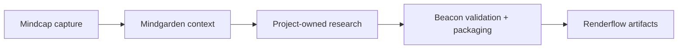
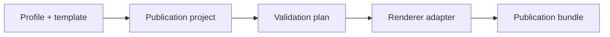

# Beacon Readiness Audit

**Repository:** `egohygiene/beacon`  
**Audit date:** 2026-08-25  
**Scope:** Beacon root, `.staging`, Reflector, Antidote, the staged NIH grant template, open issues, recent automation evidence, and the surrounding Ego Hygiene platform repositories.

## Executive finding

Beacon is closer to useful than its root repository suggests.

The root currently presents a one-line README plus the organization architecture corpus, but `.staging` contains a coherent, tested minimum vertical slice: a Rust CLI, a versioned template manifest, a Python validator, a research-paper package, project initialization, and smoke tests. The shortest route to value is to promote and harden that slice, then replace its minimal research-paper package with the reusable publication conventions already proven in Reflector.

The 144 MB third-party LaTeX intake should not be promoted with the product. It is reference material requiring per-package provenance, license, duplication, security, and compilation review. The staged NIH proposal is especially unsuitable as a canonical base: it is a duplicated 2019 CC BY-NC-SA 3.0 template containing old NIH instructional text. Beacon should re-author a current, source-linked NIH/NIMH profile from official requirements.

The recommended product sequence is:

1. promote the working Beacon core;
2. ship one reproducible `research-paper` profile from Reflector's extracted template;
3. prove it against Reflector without restructuring Reflector;
4. extract Antidote into its own repository;
5. create a current NIH/NIMH grant profile and a real proposal workspace;
6. release and expand only after those consumers work.

## Audit method and evidence boundary

This audit distinguishes checked-in evidence from target architecture.

- Repository trees, files, issues, commits, and recent Actions runs were inspected through GitHub on 2026-08-25.
- Current NIH/NIMH requirements were checked against official NIH and NIMH sources on the same date.
- `.staging` remains non-canonical intake even when its implementation is useful.
- A checked-in template or generated PDF is not treated as proof of a clean, reproducible build.
- Proposed repository relationships do not become dependencies until a versioned public contract exists.

## Current Beacon state

### Root repository

The active root contains the 18-document architecture corpus, `.gitattributes`, `.gitignore`, `LICENSE`, a one-line `README.md`, and `.staging`.

Observed gaps:

- no active `Cargo.toml`, source tree, templates, schemas, tests, or Taskfile;
- no GitHub Actions workflows or recorded Actions runs;
- no active developer environment;
- no lockfile or released package;
- no build, render, package, upgrade, or migration path;
- implementation evidence and the 2026-08-24 roadmap are now stale after the `.staging` push.

The four open issues remain format-oriented:

- `beacon#1` — reusable technical whitepaper;
- `beacon#2` — release dossier and PDF/A pipeline;
- `beacon#3` — magazine and print template;
- `beacon#5` — reusable LaTeX research-paper templates and compilation profiles.

Issue `#5` is the best existing umbrella for the first useful product path. Issues `#1`, `#2`, and `#3` should not precede a proven research-paper consumer flow.

### Working vertical slice in `.staging`

The non-corpus portion of `.staging` contains:

- Rust 2024 CLI with `list`, `inspect`, `validate`, and `init`;
- `beacon-template.toml` package manifest;
- JSON Schema documentation for manifest version 1;
- dependency-free Python template validation;
- built-in `research-paper` package with PDF and HTML declarations;
- generated `beacon-project.toml` provenance;
- refusal to initialize a non-empty destination;
- Rust unit tests, CLI smoke tests, and Python validator tests;
- a Taskfile exposing `check`, `smoke`, `list`, and `validate`.

This is meaningful implementation, but it still carries incubation assumptions:

- `Cargo.toml` points at `egohygiene/empathy` and uses `publish = false`;
- the Python validator expects an Empathy root containing `beacon/templates`;
- docs still call Beacon an Empathy holon awaiting extraction;
- the Rust and Python validators implement different subsets of the contract;
- the CLI is a single `main.rs` rather than a reusable library plus thin interface;
- the CLI validates and initializes but does not yet build or package a publication;
- initialized projects copy renderer templates and have no upgrade or compatibility model;
- `Cargo.lock` is absent;
- no clean external consumer proves the standalone paths.

### Third-party LaTeX intake

The recursive Git tree contains:

| Measure | Observed value |
| --- | ---: |
| Total Beacon entries | 1,304 |
| Total blobs | 1,036 |
| Total blob bytes | 144,374,382 |
| `.staging/latex` entries | 1,255 |
| `.staging/latex` blobs | 996 |
| `.staging/latex` blob bytes | 144,261,752 |
| Candidate template directories | 131 |
| PDFs | 174 |
| OTF/TTF font files | 131 |
| Heuristically detected license/notice files | 13 |

The low count of obvious license files is not proof that the remaining packages are unlicensed; many licenses may be embedded in PDFs or source comments. It does prove that automated promotion would be unsafe.

The intake also includes:

- packaged publisher classes and bibliography styles;
- example images and research content;
- bundled fonts;
- embedded upstream workflows and scripts;
- archive files;
- duplicate package names such as `kaobook`;
- two copies of the same NIH grant proposal tree.

Treat the corpus as inert reference intake. A later registry may ingest selected packages only after a manifest records origin, upstream version, license, checksum, redistribution status, renderer requirements, validation evidence, and disposition.

## Reference consumers

### Reflector

Reflector is the strongest available reference implementation. It already contains:

- modular native LaTeX sources;
- canonical author and publication metadata;
- version synchronization;
- citation, Zenodo, CodeMeta, release, and Pages surfaces;
- paper build, diagnostics, lint, preview, packaging, and readiness scripts;
- arXiv-oriented source packaging;
- GitHub Pages and release workflows;
- an extracted reusable `template/` tree;
- a published paper, DOI, and public site.

Reflector's reusable template was completed under closed issue `reflector#201`. It is a richer source than Beacon's current minimal Pandoc/Tera package, but it should be imported selectively rather than copied wholesale. Reflector also contains historical audits, publication-specific content, magazine assets, Python application code, and generated artifacts that do not belong in Beacon's core profile.

The correct relationship is compatibility, not ownership reversal:

- Reflector owns the Reflector manuscript, publication identity, and project history.
- Beacon owns the generalized profile, project, validation, and packaging contracts.
- Renderflow owns reusable rendering execution.
- Reflector adopts a `beacon-project.toml` compatibility declaration without a disruptive tree rewrite.

Recent Reflector evidence shows successful Pages and REUSE workflows on `main`, while the latest observed main runs do not independently prove a clean paper build. A clean consumer canary remains required before Beacon treats the extracted profile as releasable.

### Antidote

Antidote exists at `egohygiene/empathy/research/antidote` and already contains:

- a Beacon project manifest;
- a conservative manuscript scaffold;
- bibliography, figures, data, notes, and source directories;
- eight bootstrap research documents;
- explicit separation of sources, hypotheses, observations, interpretations, and claims;
- a methods/system/N-of-1 feasibility direction;
- a five-stream literature and novelty scan plan.

The extraction is already scoped in `egohygiene/empathy#71`. That issue correctly requires a standalone repository, preservation of provenance, consumption of Beacon `#5`, and removal of the second writable canonical copy from Empathy.

Antidote should be the first newly materialized consumer after Reflector proves compatibility. Its scientific content must remain project-owned; Beacon should not absorb Antidote claims, protocol decisions, or bibliography.

### NIH/NIMH proposal

The duplicated staged template begins with:

- version `1.1` dated 2019-12-26;
- CC BY-NC-SA 3.0 licensing;
- 2019 font commentary;
- a monolithic document combining Specific Aims, Research Strategy, renewal, human-subjects, animal, sharing, and other legacy instructional sections;
- obsolete URLs and prose copied into the document.

It is useful only as historical layout inspiration.

Current official requirements checked for this audit include:

- [NIH FORMS-I application guidance](https://grants.nih.gov/grants-process/write-application/how-to-apply-application-guide) for due dates on or after 2025-01-25;
- [NIH page limits](https://grants.nih.gov/grants-process/write-application/how-to-apply-application-guide/page-limits), with the NOFO and later NIH notices overriding general guidance;
- [NIH attachment formatting](https://grants.nih.gov/grants-process/write-application/how-to-apply-application-guide/format-attachments), including letter-size pages and at least 0.5-inch margins;
- the [PHS 398 Research Plan instructions](https://grants.nih.gov/grants/how-to-apply-application-guide/forms-i/general/g.400-phs-398-research-plan-form.htm);
- the required [2026 Data Management and Sharing Plan format](https://grants.nih.gov/grants-process/write-application/forms-directory/data-management-and-sharing-plan-format-page);
- current [Common Forms and SciENcv requirements](https://grants.nih.gov/policy-and-compliance/implementation-of-new-initiatives-and-policies/common-forms-for-biosketch);
- the [simplified peer-review framework](https://grants.nih.gov/policy-and-compliance/policy-topics/peer-review/simplifying-review/framework) used for most research project grants;
- [NIMH grant mechanisms](https://www.nimh.nih.gov/funding/grant-writing-and-application-process/grant-mechanisms-and-funding-opportunities);
- NIMH guidance to [contact the relevant program officer before preparing an application](https://www.nimh.nih.gov/funding/grant-writing-and-application-process/step-1-getting-started);
- the current [NIMH Strategic Plan](https://www.nimh.nih.gov/about/strategic-planning-reports);
- [NIH applicant and organization registration](https://grants.nih.gov/new-to-nih/organization-registration).

Beacon should model an NIH/NIMH application as a versioned attachment set, not one universal paper. The project must pin its activity code, NOFO, due date, applicant organization, and official-source snapshot before it can claim submission readiness. Biosketch/Common Form artifacts should remain generated and digitally certified through SciENcv rather than recreated in LaTeX.

An early concept-writing mode can still be useful before those choices are final. It should scaffold Specific Aims, Significance, Innovation, Approach, project summary/narrative, bibliography, and planning checklists while clearly labeling mechanism-dependent limits as unresolved.

## Organization fit

| Capability | Canonical responsibility around Beacon |
| --- | --- |
| Beacon | Publication project/profile contracts, initialization, validation, packaging, provenance, and distribution coordination |
| Reflector | Canonical Reflector content and reference-consumer evidence |
| Antidote | Canonical Antidote research content, protocol, evidence, and publication identity |
| Renderflow | Rendering plans, renderer execution, and reproducible transformation artifacts |
| Flow | Media and research-asset processing used by projects such as Antidote; not document rendering |
| Mindcap | Conversation/source capture and archival provenance that may feed research intake |
| Mindgarden | Research notes, literature context, relationships, and context packs upstream of publication projects |
| Akashic | Curated resource discovery; references original sources rather than becoming publication evidence itself |
| Aether | AI authoring, research-review, grant-writing, and publication skills/specifications |
| Realm | Reproducible TeX/Rust/Python environment profile |
| Relay | Reusable CI, artifact, Pages, release, and archival workflows |
| Hygiene | Repository-class and policy contracts |
| Egolint | LaTeX, Markdown, metadata, link, and repository quality rules |
| Identity | Optional publication identity inputs and generated presentation assets |
| Holon | Later repository/profile materialization; not a v0 blocker |
| Pace | Later profile/template synchronization and upgrade reconciliation |
| Observatory | Later fleet health, build, release, and publication evidence |
| Empathy | Incubation history and baseline-consumer evidence; not a Beacon runtime dependency |
| Sanctuary | Future experiments before promotion into Beacon |

The broader knowledge-to-publication flow is therefore:

Every arrow is an explicit handoff. Beacon does not become the canonical knowledge garden, and generated publication artifacts do not replace project-owned sources.

## Target contract model

Beacon needs five explicit concepts:

1. **Template package** — versioned files and renderer declarations.
2. **Profile** — a use-case policy selecting template packages, required metadata, validations, and outputs, such as `research-paper` or `nih-nimh-rpg`.
3. **Publication project** — project-owned content plus a manifest pinning profile/template versions and adapters.
4. **Renderer adapter** — a stable port that can invoke Renderflow or a documented local fallback without moving rendering semantics into Beacon.
5. **Publication bundle** — outputs, source inventory, checksums, provenance, validation evidence, and channel-specific adapters.

Profiles must be versioned independently enough that a project can pin, inspect, and deliberately upgrade them. Generated projects own their content and selected configuration; they should not silently fork Beacon internals without an upgrade record.

## Prioritized findings

| Priority | Finding | Required response |
| --- | --- | --- |
| P0 | Working code is inert under `.staging` | Promote only the standalone core and reconcile all Empathy-relative paths |
| P0 | No clean build/render canary exists in Beacon | Add a minimal fixture that initializes, validates, builds, and packages in CI |
| P0 | Research profile is weaker than the Reflector reference | Extract a small neutral profile from Reflector's completed reusable template |
| P0 | Rust and Python validators can drift | Establish one canonical schema/domain validator and test every adapter against shared fixtures |
| P0 | Antidote has two potential canonical homes | Complete `empathy#71` after the versioned research profile exists |
| P0 | NIH template is stale, duplicated, and restrictively licensed | Re-author from official sources and record the old intake as rejected/reference-only |
| P0 | NIMH mechanism, NOFO, due date, and applicant organization are unresolved | Make these explicit readiness gates while allowing a non-submission concept draft |
| P1 | No lockfile, release, or compatibility policy exists | Add deterministic dependency state and release/upgrade contracts |
| P1 | Third-party corpus dominates the repository tree | Quarantine, inventory, deduplicate, and remove binary-heavy intake from active product paths |
| P1 | Metadata and publication workflows are duplicated in Reflector | Generalize them in Beacon/Relay and leave Reflector as a pinned consumer |
| P2 | Organization materialization/synchronization is incomplete | Integrate Holon, Pace, and Observatory only after local and CI consumer paths work |

## Decisions recommended by this audit

- Optimize first for a working paper factory, not a comprehensive template marketplace.
- Promote code by evidence and boundary, not by moving all of `.staging`.
- Treat Reflector as the reference consumer and extraction source.
- Use Antidote as the first new standalone project.
- Model NIH/NIMH as a compliance-sourced profile family and attachment bundle.
- Keep a direct local workflow functional while organization-wide synchronization matures.
- Require source, license, checksum, and validation records before any third-party template becomes active.
- Keep external submissions and deposits human-gated.
- Do not block the first useful release on Holon, Pace, Observatory, a hosted UI, magazine support, or a complete marketplace.

## Conclusion

Beacon does not need a rewrite. It needs a disciplined promotion, a stronger research profile, and real consumers.

The first credible release is one where a clean checkout can initialize and build a neutral research paper, Reflector can declare compatibility without losing its identity, Antidote has become a standalone repository, and a new NIMH proposal can begin from current official structure without claiming submission readiness prematurely. The updated roadmap turns those conditions into the execution graph.
